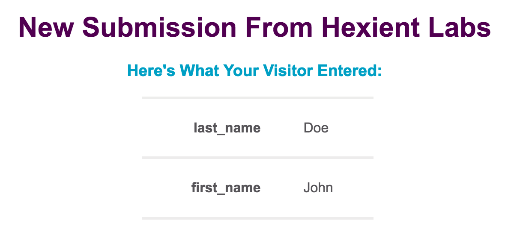

[](https://codeclimate.com/github/Hexient-Labs/hence-form)
[](https://codeclimate.com/github/Hexient-Labs/hence-form)
[](https://codeclimate.com/github/Hexient-Labs/hence-form/coverage)
[](https://travis-ci.org/Hexient-Labs/hence-form)
[](https://github.com/ellerbrock/open-source-badges/)
[](https://opensource.org/licenses/GPL-3.0/)

<p align="center">
  
</p>

# Hexient Labs HenceForm

* [Overview](#overview)
* [Example](#example)
* [Deployment](#deployment)
* [Running Locally](#running-locally)
* [License](#license)
* [Contributions](#contributions)

## Overview

Have you ever needed to set up a PHP script to relay form submissions to your email?
Well, you should use your HenceForm instead! No coding, no setup, just a
simple way to relay form data into an email.

1. Create a form on your site and set the `action` attribute on your form
  to `https://henceform.hexientlabs.com/you@youremail.com`.

1. Whenever a user fills out and submits the form, we'll send you an email
  with that data.

*Note* The first time you submit a form, it will ask you to confirm your email.
After that, you're good to go.

## Example

A form could look like:

```html
<form action="https://henceform.hexientlabs.com/you@youremail.com">
  <input type="text" name="first_name"/>
  <input type="text" name="last_name"/>
  <button type="submit">Submit</button>
</form>
```

You'll then get an email that looks like:

<p align="center">
  <kbd>
    
  </kbd>
</p>

## Deployment

Want to run your own copy of HenceForm? It's simple.

Use the Heroku Deploy button below and set the required configuration
values on the next page

[](https://heroku.com/deploy)

This project is heavily inspired by the amazing
[FormSpree](https://www.formspree.io) project.

# Running Locally

1. Install the Ruby Version specified in the `.ruby-version` file via RVM or RBenv

1. Install [PostGreSQL](https://www.postgresapp.com) and have it running

1. Install [Redis](https://www.redis.io) and have it running

1. Clone the Repo and `cd` into it

1. Install Ruby dependencies via `bundle install`

1. Copy the `.env.example` file to `.env`

1. Set all values in the `.env` file.
  This is already gitignored so don't worry about committing it.

1. Setup the database using `bundle exec rails db:setup`

1. Run the server using `bundle exec rails server`

1. Run the worker using `bundle exec sidekiq -c 5 -v -q default -q mailers`

# License

This project is licensed under the [GPL v3 License](./LICENSE)

# Contributions


This project is lovingly maintained by the [Hexient Labs](https://www.hexientlabs.com)
Engineering Team. If you like this project, consider them for your your next project


